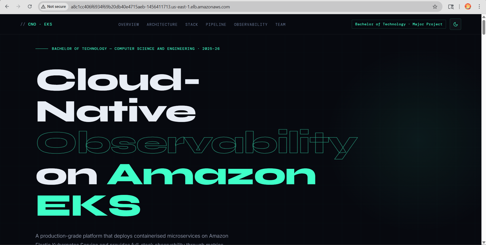
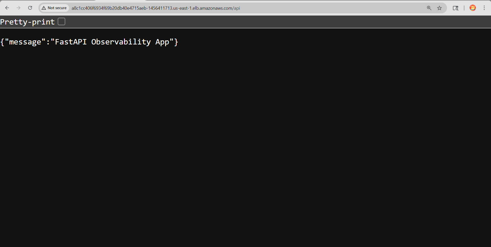
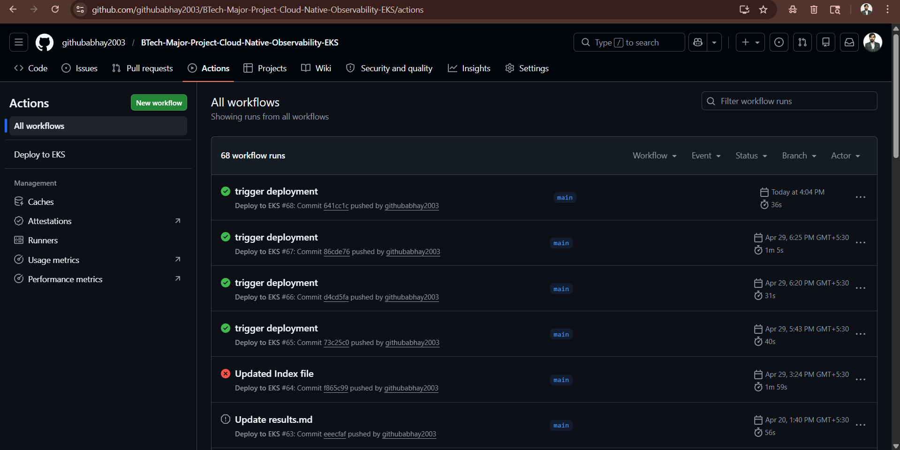
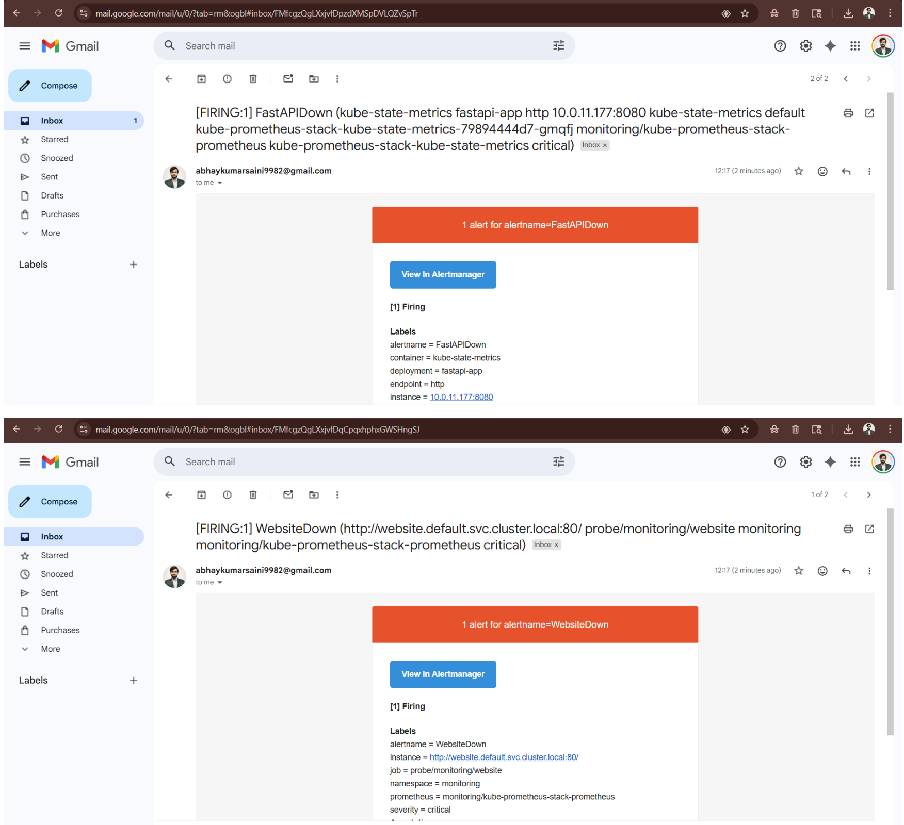
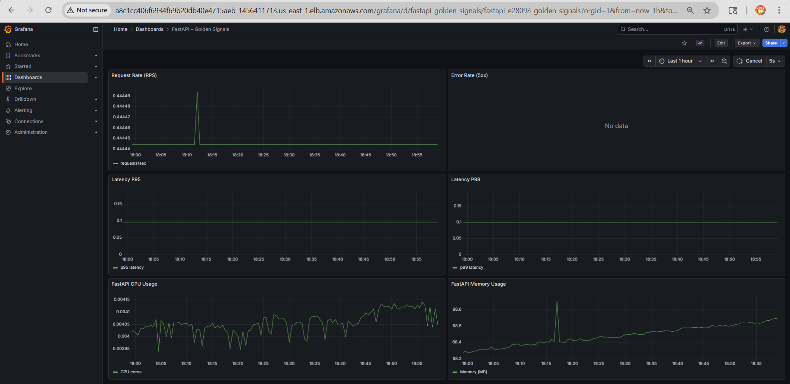

# Cloud-Native Observability Platform on Amazon Elastic Kubernetes Service (EKS)


### 🎓 Major Project (B.Tech CSE - 8th Semester)
**Institution:** Jagannath University (Faculty of Engineering and Technology)  
**Academic Session:** 2025–26  

### 👨‍💻 Team Members
- Abhay Kumar Saini (0201220001)
- Abhijeet Kumar (0201220002)
- Vaibhav Sarkar (0201220150)

### 👨‍🏫 Project Guide
- Prof. (Dr.) Om Prakash Sharma

---

## 🚀 Quick Overview

This project implements a **cloud-native observability platform on Amazon Elastic Kubernetes Service (Amazon EKS)**, showcasing how modern applications can be **automated, deployed, and monitored at scale**.

It integrates **containerization, Kubernetes orchestration, CI/CD automation, and observability** into a unified end-to-end system.

---

### **What This Project Includes**

- Backend API built with **FastAPI**
- Static frontend served via **NGINX**
- Containerized applications deployed on **Amazon EKS**
- Infrastructure provisioned using **Terraform (Infrastructure as Code)**
- Deployment automated using **Helm and GitHub Actions (CI/CD)**

---

### **Core Capabilities**

- 📦 Containerized application deployment  
- ☁️ Automated cloud infrastructure provisioning  
- 🔄 CI/CD pipeline (build → push → deploy)  
- 📊 Real-time monitoring with Prometheus & Grafana  
- 🚨 Alerting via Alertmanager  
- 🌐 Ingress-based routing for external access  

---

### **Why This Project Matters**

Modern systems require more than deployment — they need **visibility, reliability, and automation**.

This project demonstrates how to:
- Monitor system performance in real time  
- Detect failures early  
- Maintain reliability in a cloud-native environment  

---

### **In One Line**

> A cloud-native platform that automates deployment and provides real-time observability using modern DevOps practices.

---

## 🧠 Problem & Solution

### **Problem**

Modern cloud-native applications use microservices and containers, which makes them scalable but also harder to manage.

Common challenges include:
- Limited visibility into system performance  
- Delayed detection of failures  
- Lack of centralized monitoring and alerting  
- Complex and manual deployment processes  

Without proper observability, issues like high error rates or slow APIs can go unnoticed until they impact users.

---

### **Solution**

This project solves these challenges by building a **fully automated and observable cloud-native platform on Amazon EKS**.

It integrates:

- **Terraform (Infrastructure as Code)** → Automated and consistent infrastructure setup  
- **GitHub Actions (CI/CD)** → Automated build and deployment pipeline  
- **Kubernetes (EKS)** → Scalable application orchestration  
- **Helm** → Simplified and versioned deployments  
- **Prometheus + Grafana + Alertmanager** → Real-time monitoring, visualization, and alerting  

---

### **Key Objectives**

- Build a containerized application environment using Docker and Kubernetes  
- Automate infrastructure provisioning using Terraform  
- Implement CI/CD for continuous deployment  
- Enable real-time observability and monitoring  
- Configure alerting for proactive issue detection  
- Simulate a production-like cloud-native system  

---

### **Outcome**

The system enables:
- Automated deployments with minimal manual effort  
- Real-time visibility into application and infrastructure metrics  
- Faster detection and resolution of system issues  

---

## 🏗️ Architecture Overview

📄 Detailed Architecture: [docs/architecture.md](docs/architecture.md)

---

### **Architecture Diagram**

<p align="center">
  <br>
  <b>Figure:</b> <i>End-to-End Architecture of the Cloud-Native Observability Platform on Amazon EKS</i>
</p>

---

### **High-Level Design**

The system follows a **layered cloud-native architecture**, ensuring modularity, scalability, and clear separation of responsibilities.

---

### **Architecture Layers**

#### **1. External Layer**
- Users access the system via a web browser  
- Developers push code to GitHub, triggering automation  

---

#### **2. CI/CD Layer**
- GitHub Actions builds and deploys applications  
- Docker images are pushed to Amazon ECR  
- Helm deploys applications to EKS  
- OIDC ensures secure authentication  

---

#### **3. Infrastructure & Application Layer**
- AWS VPC with public/private subnets ensures secure networking  
- Amazon EKS runs containerized applications  
- NGINX Ingress routes traffic:
  - `/` → Website  
  - `/api` → FastAPI  

- Applications:
  - FastAPI backend (API + metrics)  
  - Static website frontend  

---

#### **4. Observability Layer**
- Prometheus → Metrics collection  
- Grafana → Visualization dashboards  
- Alertmanager → Alert notifications  
- Blackbox Exporter → External uptime monitoring  

---

### **End-to-End Flow**

1. Developer pushes code → CI/CD pipeline triggered  
2. Application is built and deployed to EKS  
3. Users access services via Ingress  
4. Prometheus collects metrics  
5. Grafana visualizes system performance  
6. Alerts are triggered when thresholds are exceeded  

---

### **Summary**

> A layered architecture that integrates deployment, infrastructure, and observability into a single automated and scalable system.

---
## ⚙️ Technology Stack

| **Category** | **Technology** | **Purpose** |
|-------------|---------------|------------|
| Cloud Provider | AWS | Scalable cloud infrastructure |
| Container Orchestration | Amazon EKS | Managed Kubernetes for container deployment |
| Containerization | Docker | Application packaging and portability |
| Infrastructure as Code | Terraform | Automated infrastructure provisioning |
| CI/CD Pipeline | GitHub Actions | Build, push, and deployment automation |
| Container Registry | Amazon ECR | Secure storage for Docker images |
| Backend Framework | FastAPI | High-performance Python API framework |
| Web Server | NGINX | Serves frontend and reverse proxy |
| Kubernetes Package Manager | Helm | Simplified Kubernetes deployments |
| Ingress Controller | NGINX Ingress | External traffic routing |
| Monitoring | Prometheus | Metrics collection |
| Visualization | Grafana | Dashboard visualization |
| Alerting | Alertmanager | Alert notifications |
| External Monitoring | Blackbox Exporter | Website uptime monitoring |
| Kubernetes Monitoring | ServiceMonitor, PrometheusRule | Monitoring configuration |
| Version Control | GitHub | Source code management |
| Authentication | OIDC | Secure GitHub → AWS authentication |
| State Management | S3 | Terraform state storage |
| State Locking | DynamoDB | Prevent concurrent Terraform runs |
| Compute Access | EC2 Bastion Host | Secure cluster access |

---

## 🔄 System Workflow

📄 Detailed Workflow: [docs/methodology.md](docs/methodology.md)

---

### **End-to-End Flow**

1. Developer pushes code → GitHub  
2. CI/CD pipeline (GitHub Actions) builds and pushes Docker images to ECR  
3. Helm deploys applications to Amazon EKS  
4. Applications run inside Kubernetes (pods, services, ingress)  
5. Users access services via NGINX Ingress  
6. Prometheus collects metrics from applications and cluster  
7. Grafana visualizes system performance  
8. Alertmanager sends alerts when issues are detected  
9. Blackbox Exporter monitors external availability  

---

### **Workflow Summary**

> Code → Build → Deploy → Run → Monitor → Alert

---

### **Key Principles**

- Automation-first deployment (Terraform + CI/CD)  
- Scalable orchestration using Kubernetes  
- Built-in observability for real-time visibility  
- Continuous monitoring and feedback loop  

---

## 📊 Key Features / Highlights

- 🚀 Fully automated infrastructure provisioning using Terraform  
- 🔄 End-to-end CI/CD pipeline with GitHub Actions and OIDC authentication  
- ☸️ Scalable Kubernetes deployment on Amazon EKS using Helm  
- 📦 Containerized applications using Docker  
- 📊 Real-time monitoring with Prometheus and Grafana dashboards  
- 🚨 Intelligent alerting using Alertmanager  
- 🌐 Ingress-based routing with NGINX for unified access  
- 🔍 External uptime monitoring using Blackbox Exporter  

---

## 📸 Screenshots / Demonstration

This section highlights the **end-to-end system behavior**, from user access to observability and alerting.

---

### **Application (Frontend & API)**

<p align="center">
  <br>
  <b>Figure:</b> <i>Frontend application exposed via Kubernetes Ingress (public ALB URL)</i>
</p>

<p align="center">
  <br>
  <b>Figure:</b> <i>FastAPI backend responding successfully via public endpoint</i>
</p>

---

### **CI/CD Pipeline**

<p align="center">
  <br>
  <b>Figure:</b> <i>GitHub Actions pipeline automatically building, pushing to ECR, and deploying to EKS</i>
</p>

---

### **Kubernetes Ingress (Public Access)**

<p align="center">
  <br>
  <b>Figure:</b> <i>Ingress routing traffic from external ALB to services inside the Kubernetes cluster</i>
</p>

---

### **Observability — Request → Metrics Correlation**

<p align="center">
  <br>
  <b>Figure:</b> <i>Traffic generation directly reflected in metrics, validating observability pipeline</i>
</p>

---

### **Prometheus Metrics Validation**

<p align="center">
  <br>
  <b>Figure:</b> <i>Prometheus querying real-time metrics (request rate) from instrumented FastAPI service</i>
</p>

---

### **Alerting Pipeline (Real-time Firing)**

<p align="center">
  <br>
  <b>Figure:</b> <i>Real-time alert triggered and delivered via email when system thresholds are breached</i>
</p>

---
### **Grafana dashboard (FastApi)**

<p align="center">
  <br>
  <b>Figure:</b> <i>Grafana dashboard visualizing FastAPI Golden Signals — request rate, latency (P95/P99), error rate, and resource usage (CPU & memory) in real time</i>
</p>
---

## ⚡ Quick Setup

📄 Detailed Setup Guide: [docs/setup-and-usage-guide.md](docs/setup-and-usage-guide.md)

---

### **Prerequisites**

Ensure the following tools are installed:

- Git  
- AWS CLI  
- kubectl  
- Docker  
- Terraform  
- Helm  

---

### **Setup Steps (High-Level)**

1. **Clone the repository**
2. **Provision infrastructure** using Terraform (VPC, EKS, IAM, ECR)  
3. **Configure kubectl** to connect to the EKS cluster  
4. **Deploy observability stack** (Prometheus, Grafana, Alertmanager)  
5. **Push code to GitHub** to trigger CI/CD deployment  
6. **Verify deployment** using `kubectl` commands  
7. **Access services** via Ingress endpoints  

---

### **Access Points**

| Path | Service |
|------|--------|
| `/` | Website |
| `/api` | FastAPI |
| `/grafana` | Grafana |
| `/prometheus` | Prometheus |
| `/alertmanager` | Alertmanager |

---

### **Note**

> Follow the detailed guide for complete commands, validation steps, and troubleshooting.
---

## 🧩 Key Challenges

📄 Detailed Challenges: [docs/challenges-and-learnings.md](docs/challenges-and-learnings.md)

---

- ⚙️ Terraform module dependencies required proper input/output design to avoid cross-module failures  
- 🔐 EKS access issues due to IAM–RBAC misconfiguration (`aws-auth` mapping)  
- 📦 CI/CD authentication complexity solved using OIDC instead of static credentials  
- ☸️ Kubernetes issues (labels, ingress, CRDs) caused deployment and routing failures  
- 📊 Observability gaps (missing `/metrics`) initially prevented Prometheus from scraping data  
- 🚨 Alerting pipeline misconfigurations required end-to-end validation and testing  

---

### **Key Learning**

> Building cloud-native systems requires tight integration between infrastructure, deployment, and observability — even small misconfigurations can break the entire workflow.
---

## 👥 Contributors

### **Project Team**

| Name | Role |
|------|------|
| **Abhay Kumar Saini** | DevOps, Infrastructure & Observability |
| **Abhijeet Kumar** | Application Development & Integration |
| **Vaibhav Sarkar** | Kubernetes Deployment & Testing |

---

### **Academic Context**

- B.Tech — Computer Science and Engineering  
- Faculty of Engineering and Technology  
- Jagannath University, Jaipur  
- Academic Session: 2025–2026  

---

### **Guidance**

- **Prof. (Dr.) Om Prakash Sharma** — Project Guide & Coordinator  

---

### **Summary**

> A collaborative academic project combining DevOps, cloud infrastructure, and observability practices.
---

## 📚 Detailed Documentation

For in-depth explanations and full implementation details, refer to the following documents:

- 🏗️ Architecture → [docs/architecture.md](docs/architecture.md)  
- 🔄 Methodology & Workflow → [docs/methodology.md](docs/methodology.md)  
- ☁️ Infrastructure (Terraform) → [docs/infrastructure.md](docs/infrastructure.md)  
- ⚙️ CI/CD Pipeline → [docs/cicd.md](docs/cicd.md)  
- ☸️ Kubernetes Deployment → [docs/kubernetes.md](docs/kubernetes.md)  
- 📊 Observability → [docs/observability.md](docs/observability.md)  
- 🚨 Alerting → [docs/alerting.md](docs/alerting.md)  
- 📈 Results & Discussion → [docs/results.md](docs/results.md)  
- ⚠️ Limitations → [docs/limitations.md](docs/limitations.md)  
- 🔮 Future Scope → [docs/future-scope.md](docs/future-scope.md)  
- 📚 References → [docs/references.md](docs/references.md)  
- 🧩 Challenges & Learnings → [docs/challenges-and-learnings.md](docs/challenges-and-learnings.md)  
- ⚡ Setup Guide → [docs/setup-and-usage-guide.md](docs/setup-and-usage-guide.md)

---

## 📜 License

This project is licensed under the **MIT License**, which allows flexible use while ensuring proper credit to the original authors.


### 🔹 Permissions

You are free to:

* Use this project for **personal, academic, or commercial purposes**
* Modify and improve the code
* Share or distribute the project

---

### 🔹 Conditions

* The original license and copyright notice must be included
* Proper credit must be given to the authors

---

### 📄 MIT License

```
MIT License

Copyright (c) 2026 Abhay Kumar Saini

Permission is hereby granted, free of charge, to any person obtaining a copy
of this software and associated documentation files (the "Software"), to deal
in the Software without restriction, including without limitation the rights
to use, copy, modify, merge, publish, distribute, sublicense, and/or sell
copies of the Software, and to permit persons to whom the Software is
furnished to do so, subject to the following conditions:

The above copyright notice and this permission notice shall be included in all
copies or substantial portions of the Software.

THE SOFTWARE IS PROVIDED "AS IS", WITHOUT WARRANTY OF ANY KIND, EXPRESS OR
IMPLIED, INCLUDING BUT NOT LIMITED TO THE WARRANTIES OF MERCHANTABILITY,
FITNESS FOR A PARTICULAR PURPOSE AND NONINFRINGEMENT. IN NO EVENT SHALL THE
AUTHORS OR COPYRIGHT HOLDERS BE LIABLE FOR ANY CLAIM, DAMAGES OR OTHER
LIABILITY, WHETHER IN AN ACTION OF CONTRACT, TORT OR OTHERWISE, ARISING FROM,
OUT OF OR IN CONNECTION WITH THE SOFTWARE OR THE USE OR OTHER DEALINGS IN THE
SOFTWARE.
```

---

### 📌 Note

* This license makes the project **open-source and reusable**
* Anyone can build upon this work while giving proper credit

---
